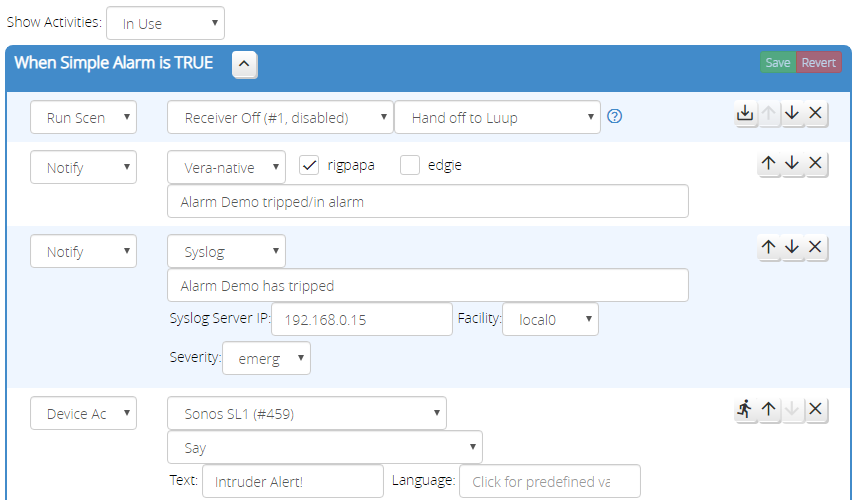
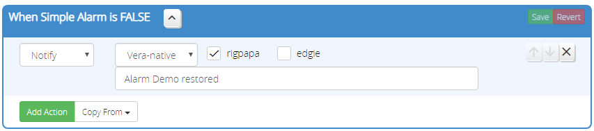
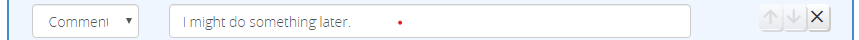

#Activities

Reactor can run actions directly, without relying on Vera scenes.
These _Activities_ are run when a condition group changes state (e.g. from _false_ to _true_ or vice versa). Each condition group has two Activities: one for when the group becomes *true*, and one for when the group becomes *false*. The activity runs only once, at the time of transition &mdash; it does not repeat continuously while the group state persists.

The following action types are available in Reactor Activities:

* [Device Action](Device-Action.md) - Run an action on a device (e.g. turn a light on or off, change dimming level or thermostat mode, etc.);
* [Delay](Delay-Action.md) - Delay execution of subsequent actions in the activity;
* [Change House Mode](Change-House-Mode-Action.md) - Change the current house mode;
* [Run Lua](Run-Lua-Action.md) - Run a Lua script;
* [Run Scene](Run-Scene-Action.md) - Run a Vera scene;
* [Run Activity](Run-Activity-Action.md) - Start another group's activity;
* [Notify](Notify-Action.md) - Send a notification;
* [Set Variable](Set-Variable-Action.md) - Set a ReactorSensor variable's value;
* [Reset Latched](Reset-Latched-Action.md) - Reset latched conditions in a group
* [Comment](#comment-action) - A comment to help you document your activity.

## The Activities Tab

The _Activities_ tab of your ReactorSensor is where you will define and edit the actions your ReactorSensor performs.

Starting at the top of the screenshot the "Show Activities" dropdown (A) lets you choose which activities are shown. Because there are two activities for each group, the list can get quite long quickly, and often only a couple of the activities are actually used, so this menu lets you filter the view. For example, if you choose "In Use", the view will only show activities that have actions in them.

Each activity has an action list: the list of actions it will perform. Actions are performed in the order shown in this list.

The "Save" and "Revert" buttons (B) appear in each action list header and are used to save the current activity configured, or revert to the last saved, respectively. The revert is the only "undo" offered, so you are encouraged to save often.

Below that are the actions. Each action has a selectable action type (C), the action parameters (D), and action controls (E). The action parameters (D) vary from action type to action type. The action controls (E) have some standard buttons and some action-specific buttons. You can see from the screenshot that every action has up- and down-arrow buttons, and an "X" button; these are "move up", "move down" and "delete", respectively. The action-specific controls are covered in the description of each action type.

At the bottom of each activity, below the action list, are two buttons: "Add Action" and "Copy From...". The "Add Action" button adds a new action to the end of the activity's action list. The "Copy From..." button presents a pop-up menu from which you can select another activity; the selected activity's actions will be imported into the current activity (at the end).

## Activities and Action Execution

Activities are "durable" across restarts and reloads of Luup. Delayed actions are run at their scheduled times, or as close as possible (if the time is missed during restart/reload, it runs immediately when reload completes).

For every group, and for the overall state of the ReactorSensor itself, there is a *true* and *false* activity (the ReactorSensor-level activities are referred to as the *trip* and *untrip* activities for historical reasons). The *true* activities are run when the group/sensor goes *true*, and the *false* activities are run when the sensor goes *false*.

When switching between *true* and *false* states, it's possible that delayed actions from the previously-started activity, called the *counter-activity*, are still running or waiting to run. If there are actions for the group's new state, the counter-activity will be stopped--the delayed actions will be cancelled and not allowed to run. If there are no actions for the group's new state, the counter-activity will be allowed to complete. For example, if you have a ReactorSensor with trip actions that turn on a light, delay 60 seconds, and then turn off the light, and your ReactorSensor untrips during the 60-second delay period *and* there are untrip actions, the turn off of the light will never happen. But, if there are no untrip actions, the trip activity will be allowed to complete and turn off the light as scheduled.

!!! note
    The existence of *any* action, even just a comment, in a group state's activity is sufficient to stop the counter-activity. So, if you have a true activity with several actions and delays, and you want those to stop on group false, putting a comment in the group's *is False* activity as the sole action is sufficient to stop the true activity.

If your ReactorSensor has several groups with activities, it is possible for multiple activities to be run, if several groups change state at the same time and have activities associated with those states. Group activities are started first, in a (post-order (LRN) traversal)[https://en.wikipedia.org/wiki/Tree_traversal#Post-order_(LRN)] order; the overall ReactorSensor trip/untrip activity is the last to be started.

!!! note "Timing is not guarantted!"
    The foregoing describes the order in which activities are *started*. But if, for example, two groups have equal delays, there is no guarantee with respect to which group will resume first when the delay period expires.

## Comment Action

The comment action doesn't actually do anything, it's just a placeholder for text that you can use to document your activity.

It does have one special feature: if the first character is a "*", the comment text is written to the ReactorSensor's event log, which can be seen in the Logic Summary (Tools tab).