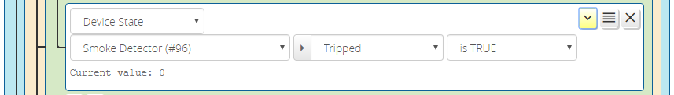

# Condition Options

In the right-side "tools" area of each condition or group in the Conditions tab is a downward-pointing arrow (chevron) that opens the options pane for the condition. Click this control to open the condition options.

When opened, the condition option pane will show the available options for that condition type. Not all condition types support all possible options.

The above image shows the options pane open. The condition options can be collapsed (hidden) by clicking the upward-pointing arrow (chevron) in the "tools" area of the condition row. 

When the option expand/collapse button is highlighted yellow, as shown below, it means that an option is set to a non-default value.

Condition options are divided into two functional groups:

* Output Control - These options affect how transitions between states (*true* -> *false* and vice versa) are signalled by the condition.
* Restrictions - These options place additional requirements on the condition for it to become *true*.

## Output Control Options

If you think of the output of a condition (or group) as a logic waveform, the *Output Control* section of the options controls the shape of the output waveform, or more correctly, its duration. The options are:

* **Follow** - This is default output mode, and it means that the output of the condition follows (is the same as) the underlying match. For example, if you were writing a condition to check that a light is on, a condition in follow mode will be on during the time that the light switch is on, and off when the switch is off. Whatever the state of the switch is, that is the state of the condition's output (other options can affect this--see below). The optional reset delay can be used to defer the transition from *true* to *false* when the test conditions are no longer met.
* **Pulse** - This output mode provides a pulse of a configurable duration when the underlying condition test matches. Continuing with our light switch condition from above, a pulse output of 10 seconds would result in the condition being *true* for ten seconds when the light is switched on, and then the condition goes *false*. The length of the pulse is not affected by any change in the status of the light switch during the pulse time--the pulse is not cut short if the light is switched off after five seconds, and the pulse is not stretched longer if the light remains on for more than the pulse length. The pulse can optionally occur once (one-shot, the default behavior), or repeat with a *false* state between *true* pulses. To get repeated pulses, choose "repeats" from the dropdown menu and enter an integer >0 in the "after" field (the length of the *false* state period, after which another *true* pulse will occur, until the condition test is *false*). So, again continuing to build on our switch example, if we configure "repeats after 20 seconds", then as long as the switch is on, there will be a 10-second *true* output of the condition, followed by a 20-second *false* output, followed by another 10-seconds *true*, and then 20-seconds *false*, and so on, until the switch is turned off. This is particularly useful for any condition that may require repeated retries or signaling, such as a generating notification that a door has been left open or a leak detected, or controlling a device with poor communication reliability. You may also specify a limit on the number of pulses (useful, for example, if you are using the pulse output mode to drive repeat notifications, to keep from spamming you indefinitely).
* **Latch** - This output mode causes the condition to hold in true state indefinitely, until it is reset by external stimulus. Latched conditions are reset by *any* the following occurring: 
    * if the latched condition is in an AND group with other conditions, the *false* transition of the parent group will reset the latched condition(s) in the group (so any other condition in the same group going *false* will cause the latch to be released);
    * a "Reset Latched" Activity action is run, either with the "All Groups" selector or the parent group of the latched condition selected;
    * a `ClearLatched` UPnP device action is run on the ReactorSensor;
    * if `ResetLatchedOnUntrip` state variable on the ReactorSensor is "1" and the ReactorSensor untrips (default 0);
    * the ReactorSensor is restarted (using the RS' control panel's "Restart" button or invoking a `Restart` action on the RS).

## Restrictions

The *Restrictions* option group contains options affecting the response to the test conditions.

### "Only After" -- Sequence Restriction
The sequence restriction is used when the order of triggering is important to the condition's meaning. For example, let's say we want a ReactorSensor that trips when a door sensor is tripped (door opened) while the house is in Away mode, but not if the door is open *when* the house enters Away mode (perhaps the door is still open because you haven't left yet). That is, the Away mode transition has to come *before* the door opens for the overall condition to be met (*true*). To implement this, the group, configured using the "AND" operator, would have two conditions. The first would be a House Mode condition for Away mode. The second would be a service condition that matches the Tripped=1 state of the door sensor device, plus the selection in the options of the first condition from the "Only after" dropdown. This means that the second condition can only become *true* if the change of the door sensor's Tripped state from 0 to 1 occurs *after* the time at which Away mode became active. If the door is already open when the house enters Away mode, the timestamp of the door opening is before that of the house entering Away mode, so the ReactorSensor will not trip. If the door is then closed, and later opens, *then* the timestamp of that later opening is after that of the house entering Away mode (meeting the "Only after" sequence restriction), so the ReactorSensor does trip. The additional "within" time specification restricts the success of the condition to the sequence of action occurring within the specified number of seconds (e.g. if B comes after A within X seconds); if 0, which is the default, there is no time restriction.

By default, the predecessor task (the task that must occur before the current task) must still be *true* for the successor task to be true. As of version 3.5, this restriction can be lifted by unchecking the "Predecessor must still be true" checkbox. As an example of how this might be used: you want to detect when the door from the garage to the kitchen is opened *after* and within two minutes of the garage roll-up door being opened, but you don't care of the garage door is still open or has been closed.

### "Sustained For" Restriction
The "Sustained for" option allows the condition to become *true* only if the test result is sustained *true* for the set number of seconds. This is useful, for example, if you want to program a condition for a door being left open for more than 5 minutes--you would set a service condition for your door sensor to test if the "Tripped" variable is equal to "1", then add the duration option "Sustained for at least 300 seconds". Any time the door is opened, the state variable value test is met, but the ReactorSensor will not consider the overall condition met and mark it *true* until that state has been sustained for an unbroken period of at least 300 seconds. This timing survives Luup reloads/restarts. 

You can invert the timing test, and require that a test result be sustained for less than a period of time for the condition to be true. This might be used, for example, if a switch is turned on and quickly turned off (and that may then turn off all the lights in the room).

### Repeat Restriction
The "Repeats" option allows the condition state to become *true* only if the condition's test state match repeats the specified number of times over the specified interval (e.g. a motion sensor trips 3 times in a minute, or a switch is turned on twice--on-off-on--within 10 seconds). This is one of my favorite options, as I use it to make "master" switches where turning a particular switch on and off twice in rapid succession turns off all the lights in the room or on that level of my house.

## More on Delay Reset
The Delay Reset option (available in *Follow* output mode only) allows you to delay the transition from *true* to *false* of a condition for a set period of time (in seconds). If, at the end of the delay period, the test state is still *false*, then the condition state goes to *false*. If the test state goes *true* during the delay, the delay is cancelled and the condition state remains *true*; if the test state later goes *false*, a new delay period is started. So, if the test state toggles between *true* and *false* multiple times within the delay period, the net effect is that the delay is extended.

This can be used to "debounce" a sensor, like a door sensor. This classic example gave rise to this option: a Reactor user wanted to send a notification when a door was opened, but if the door was opened and closed several times in rapid succession, only one notification be sent. By setting the "delay reset" period, when the door is closed, the delay goes into effect, and during the delay, any subsequent opening and closing of the door is ignored and does not trigger additional notifications, as long as those swings occur during the delay. A new notification will not be sent until the door opens after having been closed for at least as long as the delay period.

This is a particularly useful feature for motion sensors and lights: a motion sensor used to turn on a light when tripped and off when untripped will turn the light on when you enter the room and turn it off when the sensor stops sensing motion, which may be just a few seconds if you stop moving, potentially leaving you in the dark in the middle of the room. If you then just move a little, the light flicks back on. Wouldn't it be nice if the light stayed on longer? If we add, for example, a 10-minute reset delay, then the light will go on when we enter the room, and remain on, and any time we move just a little bit, the 10-minute delay starts over, thus ensuring the light remains on while we are in the room (as long as we move enough to make our continued presence known to the motion sensor). If we leave the room, the light will go out 10 minutes later. In effect, this one condition option provides the most basic function of the DelayLight plugin, and probably the most common automation requested.

## Other Useful Tricks

The transition from *false* to *true* can be delayed by the "susained for" restriction. This restriction works in all output modes (Follow, Pulse, Latch).
