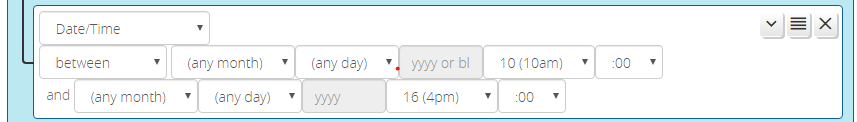

# Date-Time Conditions

Reactor has three different conditions in the "date and time" family. The anchor condition of this group is the _Date/Time_ condition, a powerful tool for matching date and time ranges. _Date/Time_ conditions can be "after", "before", "between", and "not between" specified times and dates.

Date/times may be specified as Y-M-D H:M, M-D H:M, or H:M.

* If a date/time specification is Y-M-D H:M, then it refers to an absolute time, a certain year, month, day, hour and minute;
* If a date/time specification is M-D H:M, then it refers to a certain time on a recurring day of the month each year;
* If a date/time specification is H:M (no date spec), it refers to certain time, recurring daily.

The example in the image above shows a _Date/Time_ condition set up as "H:M" to be *true* between 10am and 4pm every day; that is, the condition will go *true* at 10am (or immediately when the system becomes available if down at 10am), and *false* at 4:00pm.

Here are some additional examples:

* "between Jan 1 2018 00:00 and Jul 1 2018 00:00" refers to the entire period from midnight January 1, 2018 through June 30, 2018 23:59:59 (the end time is not included in the span);
* "between Jan 1 00:00 and Feb 1 00:00" refers the 744 hour period beginning at midnight every January 1st (of any year) and ending at 23:59:59 on January 31 of that same year (31 days of 24 hours = 744 hours);
* "before Jun 10" refers to the period from midnight January 1 of any year to 23:59:59 on June 9 of the same year--from midnight June 10 onward, the condition is not true;
* "after Jun 10" is the inverse: active starting at midnight on June 10 in any year through 23:59:59 of December 31 of that same year;
* "between Nov 10 and Feb 10" is interesting, because the start date appears to be after the end date--in this case, the period from November 10 of any year to February 10 of the following year is the active period (note this is equivalent to "not between Feb 10 and Nov 10");
* "between 10:00 and 22:00" is active between 10am and 10pm on any date;
* "between 22:00 and 10:00", like the "Nov 10" example above, the start time being after the end time creates a span over midnight--this condition is active from 10pm any day to 10am the following day;
* "after 22:00" will be *true* from 10pm until midnight, and then go *false* (i.e. "after HH:MM" is a synonym for "between HH:MM and midnight");
* "before 22:00" will be *true* from midnight until 10pm, and then go *false* (i.e. "before HH:MM" is a synonym for "between midnight and HH:MM").

Note that user interface currently does not go to exceptional lengths to keep you from doing the impossible--caveat user! One could currently, for example, set the condition up as "between Jan 1 2018 00:00 and Feb 2 2014 00:00", and this condition would simply never be met, with no warning from the user interface.

## Where's the "At" Operator?

A common question is "I want to fire an event at a particular time, but there's no 'at' operator. What do I do?"

Because your Vera may be down or reloading at a particular time, and generally it is undesirable for timed events to be missed, Reactor, it is better to use an "after" condition. The "after" condition will go *true* immediately at the specified date/time if the system is up and running, effectively providing the behavior of "at". If the system is down at that time, however, Reactor will notice when it comes back up that it is still in the window and hasn't yet triggered the condition, so it will then make the condition go *true*.

## Combining Date/Time Conditions with Others

Sometimes it's desirable to split or combine conditions. For example, you may want a ReactorSensor to be active between 10am and noon (12pm) on the first Tuesday of each month. In this case, you simply use a Weekday condition and a Date/Time condition (H:M only) in the same group. The "and" effect of conditions within a group takes care of combining the logic. Similarly, if you want to be active between 10am and 2pm every day of the month of January, you would set up two conditions in one group: the first, a Date/Time condition with "between Jan 1 00:00 and Feb 1 00:00", and the second another Date/Time condition with hours only "between 10:00 and 14:00". Note that this is different from a single Date/Time condition set to "between Jan 1 10:00 and Feb 1 14:00", as the latter would be active at (for example) 2pm, midnight, and 4am on every day of January, where the former is not. Think about it. If it's not clear to you why this would be, please contact me.
