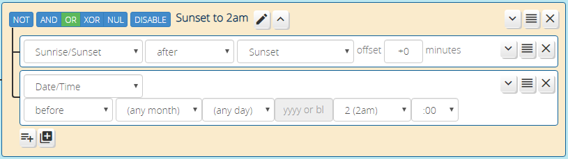

# Date-Time Conditions

Reactor has three different conditions in the "date and time" family. The anchor condition of this group is the _Date/Time_ condition, a powerful tool for matching date and time ranges. _Date/Time_ conditions can be "after", "before", "between", and "not between" specified times and dates.

Date/times may be specified as `Y-M-D H:M`, `M-D H:M`, `D H:M` or `H:M`.

* If a date/time specification is `Y-M-D H:M`, then it refers to an *absolute time*, a certain year, month, day, hour and minute;
* If a date/time specification is `M-D H:M`, then it refers to a *recurring annual day and time* (e.g. 2pm on Jan 15 of every year);
* If a date/time specification is `D H:M`, then it refers to a *recurring monthly day and time* (e.g. 2pm on the 15th of each month);
* If a date/time specification is `H:M` (no date spec), then it refers to a *recurring daily time* (e.g. 2pm daily).

The example in the image above shows a _Date/Time_ condition set up as "H:M" to be *true* between 10am and 4pm every day; that is, the condition will go *true* at 10am (or immediately when the system becomes available if down at 10am), and *false* at 4:00pm.

## Time Operators

The basic time operators for all time-oriented conditions are "before", "after", "between", and "not between". Their meaning should be clear, but it's worth nothing a couple of points:

### The "Before" and "After" Operators

Recurring date/time specifications used with the "before" and "after" operators reset at specific times. This facilitates their recurring operation (if they didn't reset, they couldn't retrigger).

* When using `H:M` recurring times, the reset occurs at midnight. That is, "before 8am" is a synonym for "between midnight and 8am", so the condition goes true at midnight, and goes false at 8am until midnight. Likewise, "after 6pm" works the same as "between 6pm and midnight" (true from 6pm to midnight, then false until 6pm the next day);
* When using `D H:M` recurring date/times, this reset occurs at midnight on the first day of each month. So a _Date/Time_ condition set up as "after the 15th 8am" would go true at 8am on the 15th and remain true for the remainder of the month;
* When using `M-D H:M` recurring date/times, the reset occurs at midnight on January 1 of each year. That is, "before March 31 5pm" would go true at midnight on January 1 each year, and remain true until 5pm on March 31, at which point it would go false and remain false for the remainder of the year.

### "Between" and "Not Between" 

When using the "between" and "not between" operators with *recurring* date/time specifications, it is possible to specify an "end" time that appears to be "before" the start time. For example, one could say "between 6pm and 6am" that any human would interpret as a period beginning at 6pm, spanning midnight, and ending at 6am the following day. Reactor interprets it this way as well &mdash; Reactor will handle this as the human expects.

### Where's the "At" Operator?

A common question is "I want to trigger an event at a particular time, but there's no "at" operator. What do I do?"

Because your Vera may be down or reloading at a particular time, and generally it is undesirable for timed events to be missed, the "Reactor Way" is to use the "after" operator. If the system is up and running normally, the condition using the "after" operator will go *true* immediately at the specified date/time, as "at" would be expected to do. But if the system happens to be down at that time, Reactor will notice when it later comes back up that it is still in the window and hasn't yet triggered the condition, so it will then make the condition go *true*.

### More Examples

Here are some additional examples:

* "between Jan 1 2018 00:00 and Jul 1 2018 00:00" refers to the entire period from midnight January 1, 2018 through June 30, 2018 23:59:59 (the end time is not included in the span);
* "between Jan 1 00:00 and Feb 1 00:00" refers the 744 hour period beginning at midnight every January 1st (of any year) and ending at 23:59:59 on January 31 of that same year (31 days of 24 hours = 744 hours);
* "before Jun 10" refers to the period from midnight January 1 of any year to 23:59:59 on June 9 of the same year--from midnight June 10 onward, the condition is not true;
* "after Jun 10" is the inverse: active starting at midnight on June 10 in any year through 23:59:59 of December 31 of that same year;
* "between Nov 10 and Feb 10" is interesting, because the start date appears to be after the end date--in this case, the period from November 10 of any year to February 10 of the following year is the active period (note this is equivalent to "not between Feb 10 and Nov 10");
* "between 10:00 and 22:00" is active between 10am and 10pm on any date;
* "between 22:00 and 10:00", like the "Nov 10" example above, the start time being after the end time creates a span over midnight--this condition is active from 10pm any day to 10am the following day;
* "after 22:00" will be *true* from 10pm until midnight, and then go *false* (i.e. "after HH:MM" is a synonym for "between HH:MM and midnight");
* "before 22:00" will be *true* from midnight until 10pm, and then go *false* (i.e. "before HH:MM" is a synonym for "between midnight and HH:MM").

Note that user interface currently does not go to exceptional lengths to keep you from doing the impossible--caveat user! One could currently, for example, set the condition up as "between Jan 1 2018 00:00 and Feb 2 2014 00:00", and this condition would simply never be met, with no warning from the user interface.

## Combining Date/Time Conditions with Others

Sometimes it's desirable to split or combine condition types. One of the most common is combining a _Date/Time_ condition with a _Sunrise/Sunset_ condition, for when you want lights to go on at sunset, which changes daily, but always go off at 11pm, a fixed time. To handle this, you simply create an "AND" group containing a _Sunrise/Sunset_ condition ("after sunset") and a _Date/Time_ condition ("before 11pm"). Combined effect: true when the current time is after sunset *and* before 11pm.

Special care needs to be taken if your recurring time condition spans midnight, though. Here are the rules for combining recurring daily conditions:

1. If the span always falls within one day (that is, does not cross midnight), the combination of conditions is `A AND B`, that is, two conditions in an "AND" group. For example, `Sunrise/Sunset after sunrise AND Date/Time before 12:00` will be *true* from sunrise to noon.

2. Combined conditions that span midnight are `A OR B`, that is, your two conditions in an "OR" group. For example, `Sunrise/Sunset after sunset OR Date/Time before 02:00` will be *true* from sunset to 2am, crossing through midnight.

The reason that case two (crossing midnight) switches to "OR" for the group operator is that all recurring time conditions reset at midnight, as stated above. That means `after sunset` on its own will only be *true* from sunset to midnight. Likewise `before 02:00` will be *true* from midnight to 2am. Using the "OR" operator on the group, in this case, combines the two separate (but adjacent) spans of time into a single unbroken *true* output of the group over the span of time.

!!! note "Think Differently"
    Sometimes thinking about a problem inside-out makes it easier. For example, we might be thinking about how to write our condition rules as "between sunset and 2am". But an equivalent rule is "not between 2am and sunset".

Conditions with dates can also be combined. If you want to be active between 10am and 2pm every day of the month of January, you would set up two conditions in one group: the first, a Date/Time condition with "between Jan 1 00:00 and Feb 1 00:00", and the second another Date/Time condition with hours only "between 10:00 and 14:00". Note that this is different from a single Date/Time condition set to "between Jan 1 10:00 and Feb 1 14:00", as the latter would be active at (for example) 2pm, midnight, and 4am on every day of January, where the former is not. Think about it. If it's not clear to you why this would be, please contact me.

## Cautions

If your logic relies on accurate time, please see the "CLOCK INVALID" topic in the [FAQ](FAQ.md). There are conditions under which the system clock can be completely invalid, and steps you can take to prevent undesirable behavior when this occurs.

## Efficiency of Date/Time and Related Conditions

Users familiar with another program logic plugin for Vera may be aware that testing against the current date and time in that tool requires the use of a "NOW" keyword in your logic, and using this keyword has a side-effect: it makes the plugin re-evaluate your logic every minute, 24x7x365, so it can make the time comparison. This can place a measurable extra load on your Vera system.

**Reactor does not do that.** Reactor instead does the necessary date/time arithmetic to figure out when the next "edge" of the condition will occur. If you create a _Date/Time_ condition in Reactor as "after 2pm," then Reactor will only evaluate that condition at 2pm (or as soon as possible after if your Vera was down at 2pm). Once it's done, it knows it doesn't need to do anything until midnight, when the condition is reset, so it's sleeping until then. Once it does the midnight reset, it goes back to sleep until 2pm the next day. This is just one way in which the author has taken great pains to make Reactor as efficient with system resources as possible.