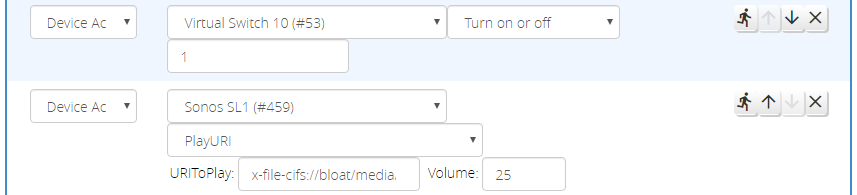
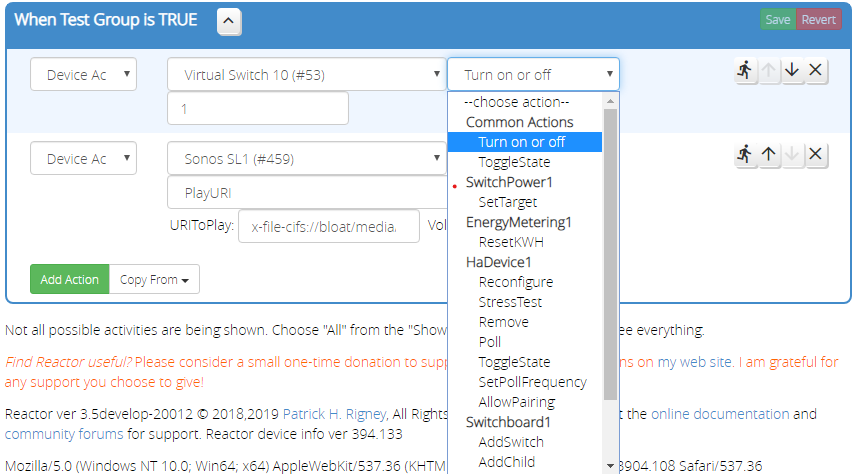
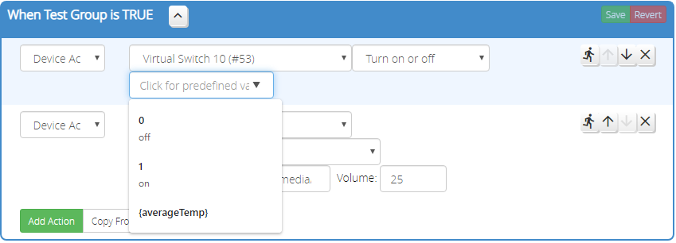

# Device Action

The _Device Action_ action performs an action on a device (who knew?).

When a device is selected, the action menu is updated to reflect the list of actions defined by the services associated with the device. Many devices will have "Common Actions," that are often performed on these devices, and these are promoted to the top of the action menu. Below the common actions, all of the devices associated services and the actions they define are listed.

!!! note
    The action list can be quite lengthy, and not every action may be implemented by the device. It's up to you to experiment and figure out if your desired action works as expected. Reactor tries not to over-constrain the UI like the Vera scene editor does, as this often results in meaningful actions being inaccessible on the interface. I'd rather give you the tools you need to figure out what works than cut you off from what you want to do.

!!! note
    HELP EVERYONE OUT: If you have a device that is missing the Common Actions part of the menu, or a frequently-used action is missing from Common Actions, or if the device has particular rules or values that apply to the parameter for an action, please let the author know, and also submit the device data using the facility provided on the "Tools" tab. I use this data to enhance the device information database that helps smooth out the UI where particular facts are known.

Once the action is selected, Reactor will display fields for the required parameters for the action, if any. Some actions have fairly "open" parameter declarations, and you're going to need to know what values can be accepted there. Some have more constrained definitions, maybe even down to a short list of acceptable values, in which case a menu is displayed rather than an input field. If error-checking is possible based on the field definition, it will be performed when you leave the field, and if an error is detected, the field will be highlighted in red. A yellow highlight indicates that the field value *may* not be acceptable, but Reactor doesn't know for sure.

The example above shows a "data list" control, which is fairly common in the action editor. It is a field that allows you to type in a value, or choose a predefined value from a list of expected/standard values. Because service definitions for devices are often not exhaustive, and there are many exceptions for values that these definitions don't provide, the data list control gives you the flexibility to choose a standard value, or enter your own if your device has a non-standard behavior.

!!! attention
    The implementation behavior and appearance of "data list" controls varies from browser to browser. Chrome/Windows is shown in these screen shots; yours may look different. On some browsers, the pop-up list of values is only presented when the field is otherwise empty, so you may need to remove a prior value to have access to the pop-up list again.

The data list also presents a list of defined expression/variable names from the current ReactorSensor, which you can select to use the then-current value of that expression in the action's parameter. For parameters that just use a plain input field instead of a data list, you can specify an expression value by wrapping the expression/variable name in "curly braces" like this: `{brightness}`.

!!! note
    Again, if you run into a field in an action for a device where Reactor can do better error-checking on the possible values, please report that to me and submit the device data on the "Tools" menu.

## Trying Your Device Action

You can quickly test your device action by clicking the "running man" icon on the action row. An alert will pop up with the result of the run. Unfortunately, it's just a fact of the way Vera works that not every action that fails will be reported as a failed action. That is, Vera will report the action succeeds, even when it doesn't actually work. You're just going to have to observe your system to see if you get the expected behavior. The real purpose of the alert is to show you the action call and the parameters that were passed, so you can verify that they are correct, in addition to observing the expected behavior of the controlled device.
