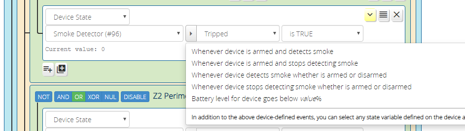

# Device State Condition

A *Device State* condition reacts to a change in device state. Whenever a device state changes, the ReactorSensor re-evaluates the condition, and apply any changes in the result state to the condition's parent group and the ReactoSensor's overall (tripped/untripped) state.

Every Luup device stores its condition in _state variables_. To create a Device State condition, you select the device you want to watch and the state variable that should be watched, and set the operator and value appropriate to the test. For example, if device #17 was a motion sensor, when you select that device from the device list, the state variable list will update to show the list of state variables defined on the device. One of these variables will be "Tripped," which is the tripped condition of the motion sensor, so you would choose that. You would then choose the condition "equals" and set the value to "1" to see if the sensor is tripped.

This is very similar to scene device triggers in Luup, with one key difference: with Vera's native scene device triggers, you can only react to predefined events that are defined for the device, and this is usually a small subset of everything that is available. Reactor allows you to set a condition based on the value of *any* state variable on the device. For most cases, the Vera-defined scene triggers adequately describe the most useful conditions for a device, so Reactor gives you a shortcut to set up the condition using the parameters of a Vera scene trigger. You do this by clicking the "events list" control shown here:

But, as mentioned above, not every capability of the device is expressed by the default list of scene triggers. In this case, you may need to specify the variable to be watched yourself. You do this by clicking on the variable list (shown below), and choosing a variable from the menu.

If you don't have a firm grasp on what Vera's state variables are, what a service is, and how services, state variables, and actions all work together, please read the [Luup State Variable Tutorial](Luup-State-Variables-Tutorial).

## Operators

The _operator_ specifies what kind of test is performed on the state variable's value: equality, inequality, string match, etc. An operator may have *operands*, the values against which the operation is performed. For example, the _between_ operator takes two operands: the low and high values of the range to match. The _updates_ operator takes no operands, because it doesn't care what the value of the state variable is, only that it was updated by the system.

The operators should be fairly straight-forward to interpret, but there are a few special ones worth mentioning, and some special cases for the operands:

* Relational operators >, >=, <, and <= require that the variable value and operands be numeric; if the variable value or either operand is non-numeric, the result is always _false_;
* The `is TRUE` operator is satisfied when the variable value is a non-zero number or any of the strings "y", "yes", "t" or "true" (case-insensitive). The `is FALSE` is satisfied when the value is zero (number) or not one of the foregoing strings;
* The `changes` operator can operate with *terminal values*, or without. A blank terminal operand means "any value". If both terminal values are missing, the condition will pulse _true_ briefly and reset itself (to extend the default length of the pulse, use the "delay reset" option in output follow mode of the [condition options](Condition-Options.md)).
* The `updates` operator is a special handler intended for a small subset of Luup's known state variables: those that send notices even when they are written with the same value they currently have. This is most importantly the variables related to locks and scene controllers that begin with "sl_" (such as `sl_UserCode` on a lock, or `sl_SceneActivated` on a scene controller). These variables often have the same value rewritten. For example, on a scene controller, if button 1 is pressed, and then sometime later it is pressed again with no button betweem, Luup writes the value "1" to the index variable each time. The *changes* operator would not detect the second press, because the value hasn't changed--it's still "1". The *updates* operator solves this dilemma by watching the timestamp of the value, rather than the value itself. Do not use the `updates` operator with state variables that do not begin with "sl_" to try to catch re-written values (it won't work--that's a Vera/Luup limitation).

> Unlike most operators, `changes` and `updates` produce a pulsed output rather than a sustained value. The default pulse length is less than one second. This happens to be too short for the Vera UI to keep up in most cases, so if you use these operators, you may not be able to see them work. However, their operation can be confirmed by any activities related to them being run. You may stretch out the pulse time using a "delay reset" [condition option](Condition-Options.md). Just be aware that long delays desensitize the condition to multiple rapid changes, because repeats inside the delay period will not trigger additional pulses.

## Condition Options

Device State conditions support most of the condition options available. Condition options modify the behavior of the condition when the test state changes. For example, the "Sustained For" condition option, when set, requires that the test remain _true_ for a configurable period of time before the condition state goes _true_.

Please see the [Condition Options](Condition-Options.md) page for detail on the available condition options and usage examples.