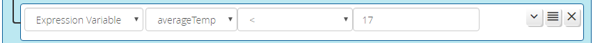

# Expression Variable Condition

The _Expression Variable_ condition tests the value of a specified Expression in the current ReactorSensor.

All of the same operators available to "Device State" conditions are available except "updates,"
so it is possible to make both string and mathematical comparisons. It is also possible to use
variable references in the operand(s).

The expression/variable must exist at the time the condition is created. You will need to visit the Expressions tab to create your variable prior to creating an instance of this condition type.

This new feature of version 3.5 is a shortcut. Prior to 3.5, testing a variable/expression had to be done by using a
self-referencing "Device State" condition, and the expression had to be marked for export. As of 3.5,
any variable/expression can be tested using the "Expression Variable" condition type, and it is not
necessary to export the variable.

If you want to test an expression/variable in a different ReactorSensor, use the "Device State" condition. The expression must also be marked for export in that ReactorSensor.

## You're Doing It Wrong

If you are using an _Expression Variable_ condition to test an expression containing only a `getstate()` functional call, that's just a less efficient way of doing a [_Device State_ condition](Device-State-Conditions.md).