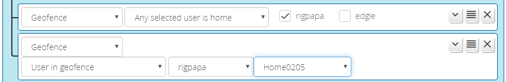

# Geofence Conditions

The _Geofence_ condition type reacts to users arriving or departing Vera-native geofences. A geofence is a virtual perimeter around a point on the globe. Reactor supports the geofences implemented the Vera mobile apps (Android and iOS).

> openLuup Users: Geofence conditions operate using data not available under openLuup, and so are not available on that platform.

> All Users: Challenges with geofencing using the Vera mobile apps have a long history. If you'd like to try an alternative method, please contact me, as I have in development-test a controller-agnostic geofencing system (for which there's a Vera/openLuup plugin, of course).

## Operating Modes

When the "Any selected user is home" mode is chosen, the condition will be true if _any of the selected users is home_.  If no users are selected (all checkboxes unchecked), then the condition will be true if any user is home.

When the "Any selected user is NOT home" mode is chosen, then the condition will be true if any of the selected users are not home. If no users are selected (all checkboxes unchecked), then the condition will be true if nobody is home.  

The "Selected user in geofence" location is true when the selected user is marked present in a selected location. The locations are taken from the user's geofencing configuration.

The users listed for these operations are those using geofencing only. If you want to add a geofence condition for a user, make sure geofencing is enabled on a mobile device to which they are logged-in, and at least one geofence is configured.

## Limitations and Caveats

This condition works only with Vera's native implementation of geofencing, supported by Vera's own mobile apps. It does not work with third-party applications, and does not work under openLuup.

Geofence state is not stored in watchable variables, so Reactor has to poll periodically (every minute) and check the status of geofences.  This is only done if geofence conditions are used, and it is only done by the Reactor master device--the master's work is shared with all children that use geofence conditions, so it's as efficient as it can be under the circumstances. But, the polling contributes a small delay to reaction time.

**IMPORTANT:** In Vera's current implementation, the geofence data isn't available directly and in isolation from the system, it has to be derived from a structure called user_data, which is the data structure that contains the entire configuration of your Vera in one, usually-huge structure. For this reason, handling the data takes a good bit of processing time. As a result, your Vera may log warning messages like "Reactor_UpdateGeofences_job took _X_ seconds", and this is expected, normal, and harmless. Hopefully Vera's newer firmware will give me more direct access that requires less work. But please note the following:
* If you are using a low-end Vera (e.g. Lite, 3) with a large number of devices and/or other plugins, I recommend avoiding the use of the "selected user in geofence" mode of this condition, as this requires considerable extra processing that your system may not tolerate well;
* If your system reports that the "UpdateGeofences" job takes more than 10 seconds, [please contact me via the Vera Community Forums](https://community.getvera.com/u/rigpapa/), as this may indicate other problems with your system data and I may be able to help you locate them and improve your system performance and stability.

> SIDEBAR: For you software types that want to know, as currently implemented, Vera takes the user_data Lua table and JSON-encodes it to a huge string (668K on my dev Vera3 with 20-ish devices), which it them passes back to me; I have to then JSON-decode that string back to a Lua table. That process takes time (5-6 seconds on said Vera3). There does not appear to be any way to access Luup's copy of user_data directly as a Lua table. Once I have the table, getting the data out just takes a few milliseconds, so if at some point we get an improved Luup API, this will resolve itself. As of 7/2019, some effort is also being made to improve the performance of the `dkjson` package (or provide a faster alternative) in upcoming firmware.

There is no notice (at least, none discovered to date) when geofencing is disabled on a user device, so no way for Reactor to differentiate between current, valid data and stale, invalid data. In these cases, the last known geofence state is the state that persists and continues to be reported.

A known issue with Vera's geofencing is that it does not correctly and immediately initialize the in/out and home states of users when geofences are added or modified. For example, if you drive to your vacation home, and set up a geofence for that location, the app and Vera will not show you in that location, even though you are sitting right there at that moment, until you get some distance from it and then come back into it. See Taming, below. Also, because of this issue, it is possible for the "home/not-home" status of a user to conflict with the "in/out" status of the user's location that is designated as their home (i.e. Vera may say the user is home, when the home location status is "out".

Another issue is that Vera will reuse geofence location IDs when geofences are deleted and new ones are created after. This can be a problem for Reactor because the only way it has to even remotely reliably identify a location is through the combination of the user ID and location ID, and Reactor doesn't get notified when locations are edited or deleted. If a location is deleted (for example, with id 2), and a new location added after (and it receives id 2), a ReactorSensor that was configured to test the prior location may end up testing the replacement location, rather than indicating that the prior location was deleted. Care should be taken when editing locations when the "Selected user in geofence" mode is used, as the edits can cause the location tested to change. Careful scrutiny of the status window will usually reveal what is happening.

## Taming Vera's Geofences

**Note**: This section is for savvy users on Android. There may be similar things one can on iOS, and if anyone knows how and would like to contribute a write-up, please have at it!

Android users can enable "developer mode" on their devices to gain control over GPS location. By enabling developer mode and installing a GPS manipulation app like "FakeGPS", you can set your position to anywhere in the world. This is great for testing geofencing, or quickly correcting the initialization problems Vera has with new and edited geofences. The author has noticed that although the GPS location change is immediately evident to other location-aware apps on the device (Google Maps, Waze, various weather apps etc.), the Vera app seems to need some other stimulus in order to fully respond to the location change. I've found that taking a brief walk around my house will usually stimulate the app sufficiently that it posts the latest change. Keeping the Vera app's "notify" checkbox on for the geofence is also a must, so you know what's going on.
