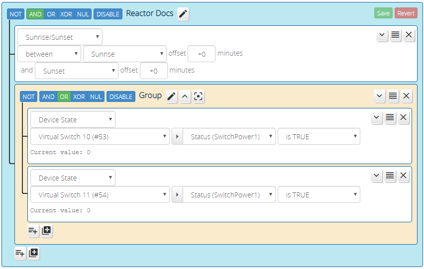

# Getting Started

> Hint: the fastest way to get started with Reactor is to [watch some of the introductory YouTube videos I've created](https://community.getvera.com/t/reactor-tutorial-and-cookbook-videos-on-youtube/208834), which will walk you through real world examples and show you to build automations.

## Concepts and Terminology

Reactor responds to changes in device and system states. When something Reactor is interested in (which you define) changes, Reactor evaluates user-defined *conditions* to see if a specific set of conditions matches or not. If the conditions are met, Reactor will run an *activity*, which contains actions that can manipulate devices or change system states.

The conditions are contained in a *ReactorSensor*, a child device of the main Reactor device that is used as an organizational container for conditions and activities. You may create as many or as few of these ReactorSensors as you need &mdash; they are light on system resources, there is no limit other than practical, and there is no fee or limit enforced when you reach a certain number of ReactorSensors.

> Did I mention that Reactor is free? That's right. No charge. For any amount of logic you want to build. Support through the Vera Community Forums is also included. I will never charge for Reactor (but [donations are appreciated](https://www.toggledbits.com/donate) to support this and other projects).

Conditions are organized into *condition groups* (or simply *groups*). A group of conditions has a logic operator associated with it. A group with two conditions that uses the "AND" logic operator will only be true when *both* conditions are true (A AND B). A group that uses the "OR" operator will be true when *any* of the conditions is true, but false when none of them is true (A OR B). And so on. Reactor supports the boolean operators AND, OR, and XOR (exclusive-or), and the inversion operator NOT.

Originally, Reactor's purpose was simply to provide better triggering for Vera scenes, and it did that by creating virtual binary sensors. A Vera scene can be easily triggered by the true and false states of a binary sensor, so it made sense to users new and experienced. This is why these logic containers are called Reactor*Sensors*, and to this day, ReactorSensors are still binary sensors, although there are now better ways to use them.

Now, ReactorSensors have their own "scenes", multiple scenes, in fact, which are called *activities*. Activities are more powerful than scenes in the following ways:

1. For any group of logic conditions in the ReactorSensor, you automatically get two activities: one that can be run when the group result changes to *true*, and one that can be run when the group result goes *false*. These are held together with the groups, so you don't have a proliferation of Vera scenes.
2. Activities are tracked and managed by Reactor, so reloads or power failures that occur while an activity is running do not abandon the unfinished work of the activity: the actions resume when the Vera is back up and running.
3. Activities offer more options to control things in the system without resorting to Lua coding or installing additional plugins.
4. Activities can be edited without requiring a Luup reload, which not only makes you automation development faster, but reduces downtime in live controllers (because Murphy will ensure that your wife is coming up the dark basement stairs at the moment you just saved a scene change, so Vera is reloading and the motion sensor's call to turn on the lights therefore goes unnoticed &mdash; except by her).

So to recap, a *ReactorSensor* is a container for an arbitrary number of logic *groups*, and *activities* that can be run in response to the changing result of those logic groups. The groups themselves can contain an arbitrary number of *conditions*, which are rules you define to test device and system states.

Here's an extremely basic Reactor project to get you familiar with a few of the core functions and interface elements you'll need to know. This isn't meant to be an exhaustive tutorial, just an introduction.

## Making Your First ReactorSensor

When you first install Reactor, the only device you have is the master Reactor device, also referred to as the *plugin device*. This device is the ringmaster for an arbitrary number of *ReactorSensors*[^1] (abbreviated to RS), which are child devices you must first create. To create a ReactorSensor, go into the control panel of the Reactor master device and click the "Add Sensor" button. Creating a "child" device on Vera causes a Luup reload, which will happen immediately, and your system will be busy for a few seconds. While that's going on, refresh your browser (CTRL-F5 for Chrome/Win, SHIFT-F5 for Firefox/Win, CMD+SHIFT+R for most Mac browsers). **Don't skip this last step &mdash; it's very important.**

## Status Tab  &mdash;  The Dashboard of Your ReactorSensor

After creating your new ReactorSensor, go into its device control panel. You will find yourself on the "Status" tab. Since this is a brand new ReactorSensor, it's not going to show you much of any interest, but you should see the default condition, which is just a comment welcoming you.

When you add conditions to your ReactorSensor, which we'll get into shortly, they will appear here along with their condition status. So this is a central view of your ReactorSensor's activities that you will find useful for verifying and debugging the operation of your logic conditions.

## Conditions  &mdash;  Deciding When Action Needs to be Taken

The core thing you will have to do with all ReactorSensors is set up *conditions*, which are the tests that it performs. This is done in the "Conditions" tab of a ReactorSensor. Go into the ReactorSensor you created above, and you'll see the tab there &mdash; click it. You'll see that you're in editing mode for a comment condition, which is the minimal default that a new RS starts with. You can change that, so choose "Service" from the menu that currently says "Comment". The "Service" condition is the test that looks at device states. You'll then see a menu that lists all of your devices. Choose a switch (preferably one conveniently near your computer, but it doesn't matter which/what it controls). Then choose the "Status" variable from the next menu (if there are multiple Status entries, choose the one that says "(SwitchPower1)" after it).

> Sidebar: Luup/Vera uses a model of *services*, derived from UPnP. A service is a collection of behaviors and states that a device can have. Light switches, for example, would be expected to implement the "SwitchPower1" service. The service defines *actions* and *states*; actions are things the device can do, like turn on or turn off, and states are properties of the device, like whether it is current on or off. States are stored in *state variables*, and these are the things listed in that menu where you chose "Status" above. So, the hardest part about learning automation with Vera, is that you have to learn which service and state variable your condition lives in. For a switch, the on/off state lives in the SwitchPower1 service's `Status` state variable. A device can have multiple services. For example, a simple on/off switch might only implement the SwitchPower1 service, but a dimmer implements both SwitchPower1 and Dimming1 &mdash; the former tells you it can be turned on and off like a simple switch, but the latter tells you that you can also set brightness. You'll get to know these services over time. Although there are A LOT of them, only a handful of state variables in a handful of services are actually relevant for most of what you'll need to do.

The last thing we want to do with our first switch condition is decide about the state of the switch, so to make life interesting, let's just say we want to know when the switch is *off* (just to be different). Next to the menu now showing the selected "Status" variable, you'll see a menu of operations... choose "is FALSE" (you could also choose the "equals" operator and enter "0" as the operand in this case). That completes the editing for now, so click the "Save" button.

Now go back to your Status tab. You should see now that your ReactorSensor is showing your switch condition. If your switch is currently off, the condition will be highlighted with bold green text, indicating that the condition has been met. If you walk over to that switch and turn it on, you should shortly see that the condition display goes to black[^2]. Since we set up the test with an "is FALSE", the condition is met (true) whenever the switch is off, and not met when the switch is on (i.e. the condition state is the reverse of the switch state).

## Activities  &mdash;  Turning Decisions into Actions

Now you want to do something with that information, so head over to the "Activities" tab in your RS. This looks a bit like the Conditions tab/editor, but this is where you specify actions that your RS needs to perform. You'll see two empty activity groups: *<sensorname> is TRUE* and *<sensorname> is FALSE*. The "is TRUE" activity is performed when your conditions are met. Your "is FALSE" activity is performed when your conditions are later unmet. We'll leave creating actual actions up to your discovery.

Something we ignored above is that you were configuring that condition in a *group*. A group is simply a collection of conditions. 
In the simplest case, you will have one group, as you do in this example, which is called the "root" group. The root group is the mother of all groups. You can create additional groups, and they will all live within the root group. This is the way you can mix and match conditions with operators other than "AND". For example, if you want to do something when it's between sunrise and sunset and either of two switches is on, that put in slightly different language is: between sunrise and sunset *and* ( switch one is on *or* switch two is on ). Those parentheses tell you to make a subgroup: you would have a Sunrise/Sunset condition in the root group set for AND, then add to that a new group, set for OR and containing your two Device State conditions to check your switches:

Before you venture into deeper learning, the last thing you need to know is that Reactor only runs activities *once per state change*. To illustrate what this means, let's say you have an RS with just one condition that looks at a temperature sensor and tests to see if the current temperature is greater than or equal to 25C. When the temperature sensor reports 24C, the condition is not met, so it is false, and since it's the only condition in the only group, the RS will be untripped. When the temperature climbs to 25C, the condition is then met, so the group becomes true and the RS becomes tripped, so the tripped activities are then run. Then a short time later, the temperature climbs and the sensor reports 26C. At this point, the condition was already met at 25C &mdash; it's *true* and it can't get more true (true/false is binary &mdash; it is or it isn't &mdash; unlike politics, there are no degrees of true and false, no grey areas between). So, since the condition is already true, and the group true, and thus the RS is already in tripped state, the tripped activities *are not* run again. Activities only run when state *changes*.

---
[^1] Historical note: ReactorSensors are called that because they implement the *SecuritySensor1* service, which is to say, they implement the actions and states of a security sensor, like a door or motion sensor. The first versions of Reactor used Vera scenes to perform actions, and since scenes can be triggered by security sensors natively, having Reactor implement this behavior made it easy to trigger the necessary scenes. As of version 2.0, however, Reactor has its own *Activities*, which offer more features than Vera scenes. The terms *tripped* and *untripped* are used to describe the state of ReactorSensors because these are the states a security sensor can have (i.e. a motion sensor that detects motion, or a door sensor on an open door, is said to be tripped). Although Activities can replace scenes, you can still use scenes with Reactor if you wish, even in combination with Activities. Sometimes scenes are handy, because you want access to them in the UI. For example, if you have a set of actions that need to be performed by several different subsystems and/or from the UI, a scene may be a good choice, as it can be used like a subroutine.

[^2] Instantaneous response to a manual press/change of a switch requires that the device implement some form of "instant status." Not all devices do. If your RS status doesn't change immediately when you're manipulating your switch by hand, try changing the switch state via the Vera UI. If the RS condition then updates immediately, your switch doesn't support instant status.
