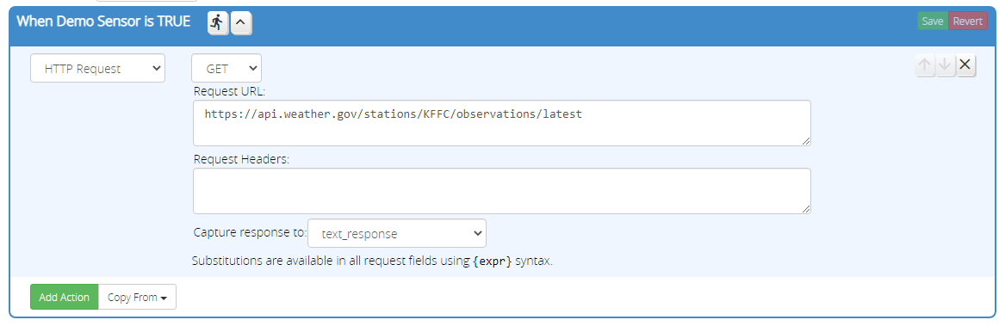
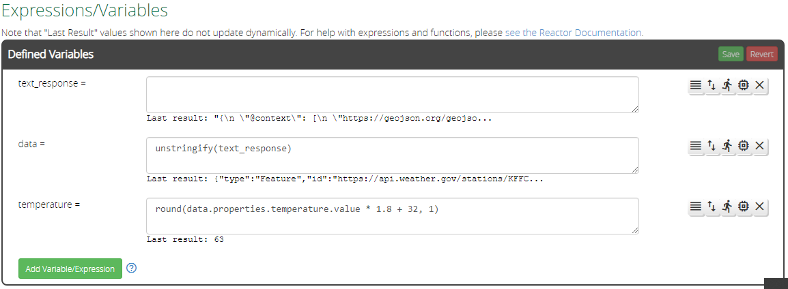
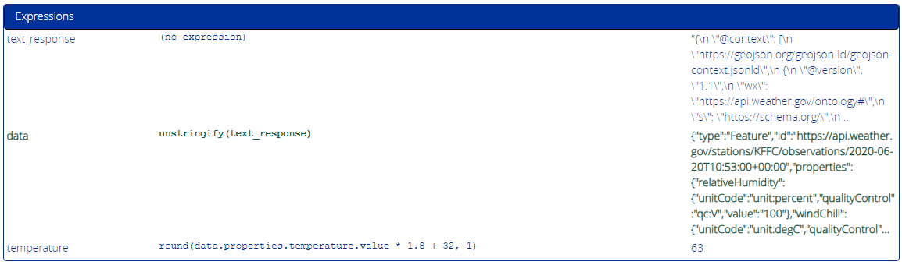

# HTTP Request Action

The HTTP Request action allows the Activity to make an HTTP GET or POST request to a remote URL. The response from the target server can be captured in an expression-less variable for further processing. This essentially gives Reactor a built-in abbreviated version of the SiteSensor plugin.

Variable substitution using the standard `{varname}` syntax is supported in all fields. This is particularly useful in the HTTP GET query parameters, allowing them to be dynamic. It is recommended that the variable value be URL-escaped, which is straightforward by simply wrapping the variable name in a `urlencode()` function call like this: `{urlencode(varname)}`.

You may specify HTTP headers, one per line, to be sent with the request.

On POST queries, a data field is displayed allowing you to specify what data is to be sent. The action will automatically supply a `Content-Length` header for all POST requests, so you do not need to generate this yourself. Take care, however, that your headers include the correct `Content-Type` header for the type of data being sent.

Responses are always strings, so particularly in the case of JSON responses, you need to pass the response through the `unstringify()` function to convert it to a table. From there, you can create other expressions to draw the required data elements out of the table, just as you would with SiteSensor.

## Response Size Limit

Because a server can return a response of virtually any length, and the response is necessarily buffered in RAM and also possibly stored in state for other expressions to use, it is necessary to limit the number of bytes accepted from the remote host. Were this not true, it would be possible for the remote host to return a response of such a size that would cause your system to instantly crash (a condition that may be very hard to troubleshoot, as it may appear to happen randomly).

The default limit is 2048 (2K) bytes. It can be increased by setting the `RequestActionResponseLimit` state variable of the ReactorSensor. Caution must be exercised, however, as the capacity of the system to store and handle the response is not infinite. Values much larger than 8192 (8K) bytes should be regarded with increasing suspicion. Corruption of state data and erratic operation of the ReactorSensor, or system crashes, may result if the limit is set too high. There is no hard rule, however, as the actual limit your system can tolerate will depend on the number of other plugins installed, how much memory they consume, etc.

Responses larger than the limit are truncated. This may cause errors in other expressions &mdash; the classic example is a large JSON response that becomes unparseable when truncated. The "Events" section of the Logic Summary will log truncation events and the actual size of the response, to help guide you in adjusting the response limit if necessary.

!!! attention "Try to Use Optimal Queries!"
    Your first, best option is to try to use queries that give you the data you need with the smallest response size possible. When querying a weather service, for example, a query that is as specific as possible may yield a desirable compact response, as opposed to requesting a multi-day forecast but using only current conditions from the response.

!!! attention "Trap: When You Have a Hammer, Everything Looks Like a Nail"
    If you find yourself processing very large responses regularly, you might do better using the SiteSensor plugin to collect the response and have the ReactorSensor grab the data from the SiteSensor device.

## Timeout

Currently, the default timeout is set to 15 seconds. The timeout can be adjusted by setting the `RequestActionTimeout` state variable on the ReactorSensor. The timeout is therefore the same for all *HTTP Request* actions made by the ReactorSensor; it is not configurable on a per-request basis.

## Errors

Errors in the request that cause the remote server to return an error, or responses that exceed the response length limit, will cause messages to be logged to the "Events" section of the ReactorSensor's Logic Summary (Tools tab), and the LuaUPnP.log, and in normal operation will also set the "trouble" flag on the ReactorSensor.

!!! attention "Check the Log!"
    If your query is not performing as expected, always check the "Events" section of the ReactorSensor's Logic Summary (Tools tab) and the LuaUPnP.log file. Error messages are logged to these locations. Because of the wide range of possible services to which this facility can connect, you are expected to be the expert on your target and its possible responses. It is too difficult to remotely troubleshoot queries to an even more remote service, and study and interpret the documentation and details of every endpoint you might choose to contact, so the author will not provide support for specific connectivity or response issues arising from your use of this action.

## A JSON Example

Here's an example that fetches the latest weather (from the US National Weather Service). 

The expression-less variable `text_response` was first created so it could be assigned in this action:



Here's what the typical response for this query looks like:

```json
{
	"type": "Feature",
	"id": "https://api.weather.gov/stations/KFFC/observations/2020-06-20T10:53:00+00:00",
	"properties": {
		"relativeHumidity": {
			"unitCode": "unit:percent",
			"qualityControl": "qc:V",
			"value": "100"
		},
		"windChill": {
			"unitCode": "unit:degC",
			"qualityControl": "qc:V",
			"value": null
		},
		"@type": "wx:ObservationStation",
		"precipitationLast3Hours": {
			"unitCode": "unit:m",
			"qualityControl": "qc:Z",
			"value": null
		},
		"dewpoint": {
			"unitCode": "unit:degC",
			"qualityControl": "qc:V",
			"value": "17.2"
		},
		"windGust": {
			"unitCode": "unit:km_h-1",
			"qualityControl": "qc:Z",
			"value": null
		},
		"windSpeed": {
			"unitCode": "unit:km_h-1",
			"qualityControl": "qc:V",
			"value": "0"
		},
		"barometricPressure": {
			"unitCode": "unit:Pa",
			"qualityControl": "qc:V",
			"value": "101930"
		},
		"icon": "https://api.weather.gov/icons/land/day/fog?size=medium",
		"cloudLayers": [{
			"base": {
				"value": null,
				"unitCode": "unit:m"
			},
			"amount": "CLR"
		}],
		"presentWeather": [{
			"rawString": "BR",
			"weather": "fog_mist",
			"intensity": null,
			"modifier": null
		}],
		"precipitationLastHour": {
			"unitCode": "unit:m",
			"qualityControl": "qc:Z",
			"value": null
		},
		"@id": "https://api.weather.gov/stations/KFFC/observations/2020-06-20T10:53:00+00:00",
		"elevation": {
			"value": "246",
			"unitCode": "unit:m"
		},
		"heatIndex": {
			"unitCode": "unit:degC",
			"qualityControl": "qc:V",
			"value": null
		},
		"precipitationLast6Hours": {
			"unitCode": "unit:m",
			"qualityControl": "qc:Z",
			"value": null
		},
		"minTemperatureLast24Hours": {
			"unitCode": "unit:degC",
			"qualityControl": null,
			"value": null
		},
		"textDescription": "Fog/Mist",
		"seaLevelPressure": {
			"unitCode": "unit:Pa",
			"qualityControl": "qc:V",
			"value": "101880"
		},
		"temperature": {
			"unitCode": "unit:degC",
			"qualityControl": "qc:V",
			"value": "17.2"
		},
		"rawMessage": "KFFC 201053Z AUTO 00000KT 4SM BR CLR 17/17 A3010 RMK AO2 SLP188 T01720172",
		"visibility": {
			"unitCode": "unit:m",
			"qualityControl": "qc:C",
			"value": "6440"
		},
		"maxTemperatureLast24Hours": {
			"unitCode": "unit:degC",
			"qualityControl": null,
			"value": null
		},
		"timestamp": "2020-06-20T10:53:00+00:00",
		"station": "https://api.weather.gov/stations/KFFC",
		"windDirection": {
			"unitCode": "unit:degree_(angle)",
			"qualityControl": "qc:V",
			"value": "0"
		}
	},
	"geometry": {
		"coordinates": [-84.5699999, 33.36],
		"type": "Point"
	},
	"@context": ["https://geojson.org/geojson-ld/geojson-context.jsonld", {
		"unit": "http://codes.wmo.int/common/unit/",
		"geo": "http://www.opengis.net/ont/geosparql#",
		"city": "s:addressLocality",
		"value": {
			"@id": "s:value"
		},
		"bearing": {
			"@type": "s:QuantitativeValue"
		},
		"s": "https://schema.org/",
		"publicZone": {
			"@type": "@id"
		},
		"@vocab": "https://api.weather.gov/ontology#",
		"distance": {
			"@id": "s:Distance",
			"@type": "s:QuantitativeValue"
		},
		"forecastOffice": {
			"@type": "@id"
		},
		"state": "s:addressRegion",
		"county": {
			"@type": "@id"
		},
		"forecastGridData": {
			"@type": "@id"
		},
		"unitCode": {
			"@id": "s:unitCode",
			"@type": "@id"
		},
		"@version": "1.1",
		"geometry": {
			"@id": "s:GeoCoordinates",
			"@type": "geo:wktLiteral"
		},
		"wx": "https://api.weather.gov/ontology#"
	}]

}
```

Since all responses are text strings, we need to parse this JSON back into data we can access. We add a new expression called `data` that uses `unstringify()` to convert `text_response` from a text string into data again (a table/object). We can then extract the temperature using another expression that traverses the structure of `data`:



When we trigger the activity (by whatever means you choose to implement), the *HTTP Request* action loads the response into `text_response`, and then the remaining expressions convert and extra the data. You can see here that the returned temperature is 63&deg;F (the `temperature` expression includes the access to the data element and conversion from &deg;C to &deg;F).


