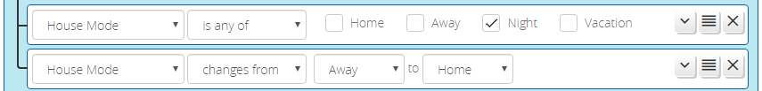

# House Mode Condition

The _House Mode_ condition allows you to react in two ways: when the house mode becomes any of a selected set of modes (e.g. when the house mode becomes "Away" or "Vacation"), or to a transition between two specific modes (e.g. when the house mode transitions from "Away" to "Home"). The image below shows each of these:

In the first condition, the condition would go *true* when the house mode changes to "Night", and remains true while the house mode remains "Night". The second condition would go *true* only when the house mode changes from "Away" to "Home", and remain true only while the house mode remains "Home".

## Performance

Reactor will trigger almost immediately when the house mode change takes effect, and is far faster than other plugins at doing so. Most other plugins poll the house mode &mdash; they read it from the system data every minute (or more frequently if so configured), but if the house mode changes at 10 second after the minute, it's 50 more seconds before they poll again and finally see the change. Reactor uses a special edge detection technique that is nearly instantaneous.

## Limitations

House mode changes are posted to the above-mentioned storage when any change delay completes. Reactor does not "anticipate" a house mode change (i.e. you don't know when the delay period starts). The house mode change delays are set in the Vera UI from the dashboards "My Modes" panel.