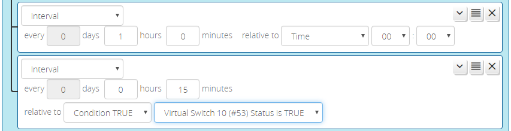

# Interval Condition

The _Interval_ condition is like a free-running timer &mdash; it becomes _true_ for a (very) brief period at specified intervals, allowing you to trigger periodic activities that may not necessarily be tied to a specified date and time. Reactor will try to preserve the timing as closely as possible across reloads or other events (like power failure) where the interval comes due while Vera is unavailable &mdash; it will run the missed task immediately, and then get back on schedule.

To specify an interval, just enter the number of days, hours, and minutes in the interval (one of them must be non-zero). The condition will become true on that interval and then automatically reset. This reset pulse is very quick &mdash; shorter than the UI can display. You can stretch the length of the interval pulse period using either a delayed reset (in output follow mode, the default) or changing the output mode to pulsed.

By default, all intervals are relative to midnight. That is, if you set an interval for every 90 minutes, it will occur at 00:00, 01:30, 03:00, 04:30, 06:00, ..., 22:30, and 00:00 (i.e. starting at midnight and every 90 minutes thereafter). If you wish to have the interval offset from a different time, you may specify that time with the "relative to" fields. For example, if we set the relative time for our 90-minute interval to 02:15, then the interval will trigger at 02:15, 03:45, 05:15, 06:45, 08:15, etc. The interval always passes through (occurs on) the "relative to" time.

It is also possible to have the interval sync to the last *true* transition of another condition, as shown in the second _Interval_ condition in the screenshot above (note the "relative to" selection of "condition TRUE"). In this configuration, the _Interval_ condition first fires when the "gating condition" goes *true*, and then at each time interval thereafter while the gating condition remains true. When the gating condition is false, timing is stopped and the _Interval_ condition does not go *true*. As it applies to the example, the _Interval_ would first trigger when the "Virtual Switch 10 Status is TRUE" condition goes true (i.e. the switch is turned on), and then every 15 minutes thereafter while the switch condition remains true. When the switch is turned off, the _Interval_ stops triggering.

!!! attention "Deprecated Feature!"
    The use of the "relative to Condition TRUE" feature of the _Interval_ condition is now deprecated. The preferred mechanism to use the "Pulse" output mode on what would be the gating condition of the _Interval_ condition (see [Condition Options](Condition-Options.md)). This feature will be removed from a future release, so you are encouraged to update your logic accordingly.

## "Proper" Use of Interval Conditions

Generally speaking, it is not necessary to use an Interval condition to force the *re-evaluation* of other conditions. Reactor is sensitive to change for all condition types, so re-evaluations at times other than a detected change just wastes CPU cycles. The exception is a variable value, other than that resulting from the use of `getstate()`, that needs periodic recomputation for some purpose, such as an accumulator, time series generator, or random number generator. It is not necessary to use _Interval_ conditions to force re-evaluations of `getstate()` dependencies because the subject device is watched, so a change to the watched state variable is detected immediately and causes a re-evaluation, just as it would if the state variable were used in a _Device State_ condition.
