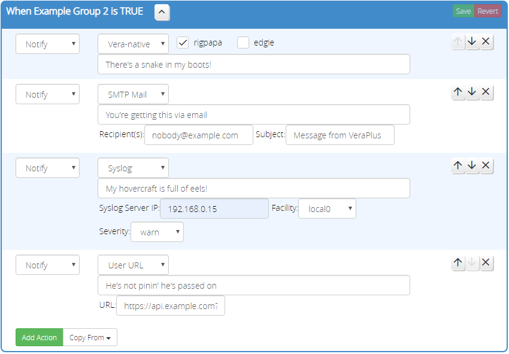

# Notify Action

The _Notify_ action sends a notification using an available notification mechanism.

Each notification method has its own requirements and limitations; see below.

## Notification Methods

The following notification methods are currently supported.

### Vera-native

The *Vera-native* method sends a notification through Vera's servers using the native Vera notification mechanism, *unless VeraAlerts is installed* (see below). This mechanism is available on all Vera Luup installations, and is the default notification method.

If VeraAlerts is installed *and* its "Process Notifications" setting is turned on, then VeraAlerts overrides Vera's built-in notification mechanism. VeraAlerts will take over the hidden scenes and insert its own Lua code in the scene. This Lua code imports the message and recipient lists, making them uneditable in Reactor--you could edit them, but it would not change in VeraAlerts until you went in there and edited them as well. To avoid the duplication of effort this creates, Reactor detects when VeraAlerts has modified a notification scene and makes the notification uneditable in Reactor from then on. Editing of the notification must take place in VeraAlerts. Reactor will import changes from VeraAlerts any time the Activity tab is opened on the ReactorSensor, just to ensure that both locations shows the same data.

Messages sent using the *Vera-native* method (regardless of whether VeraAlerts is installed or not) do not expand ReactorSensor expression variable references, as they are driven by hidden scenes (the Vera way), and the embedded messages in those scenes cannot be changed "on the fly" (they require a Luup restart to take effect). If you need to include expression variable values in your message, use a method other than *Vera-native*.

### VeraAlerts Direct

The *VeraAlerts Direct* method uses the VeraAlerts `SendAlert` action to directly send a message without passing through Vera built-in scene-based notification mechanism. By using this direct action, messages may contain expression variable references using the usual `{variableName}` syntax.

### SMTP Mail

The *SMTP Mail* method uses the Lua `socket.smtp` library to send a SMTP (Simple Mail Transfer Protocol) message. A subject and list of recipients may optionally be specified; if not specified, the default subject and recipients will be used. Email addresses specified with this method must be in the form `someone@domain` or `Name <someone@domain>` and may not contain commas, even if quotes are used (e.g. `"Lastname, Firstname" <someone@domain>` is not acceptable).

**NOTE: This method does not currently support STARTTLS.** STARTTLS is a special SMTP command that converts an open, non-encrypted channel to encrypted, and is often used between SMTP clients and servers (it is particularly associated with port 587). This is a limitation of the underlying libraries used. As an alternative, many servers support fully-encrypted (SSL/TLS, from the start) connections on port 465.

In order to use this method, you are *required* to configure *all* of the following state variables on the Reactor master device:
* `SMTPServer` - The hostname or IP address of the SMTP server to which the message is sent (for relay);
* `SMTPSender` - The email address of the sender;
* `SMTPDefaultRecipient` - The default recipient email address (or list for multiple, comma-separated, no spaces); your *Notify* action can override the default by specifying a non-blank recipient field on the action, but if it's blank, this list will be used.

Optionally, there are a few SMTP configuration state variables that have default values you can override, if necessary.
* `SMTPUsername` - If your server requires authentication, store the username here;
* `SMTPPassword` - If your server requires authentication, store the password here;
* `SMTPPort` - If you need to connect on a port other than the default 25, specify that port number here. If port 465 is used, the connection to the server will be made via SSL/TLS. See note regarding STARTTLS above.
* `SMTPDefaultSubject` - The default subject (when your *Notify* action's subject field is blank). If this value itself is empty/blank, the ReactorSensor name is prepended to the word "Notification" to form the default subject.

Any error that occurs in communication with the SMTP server will be logged to the LuaUPnP log file. Please look there for messages before posting "it doesn't work" messages on the community forums. Configuration problems with either the state variables required for this method or the mail server cause most problems. The author will not provide diagnostic support for your network or mail server.

### Prowl

The Prowl method sends the requested message to the Prowl servers. Setup of the `ProwlAPIKey` on the Reactor master device is a prerequisite to using this method. An API key can be sourced from the Prowl service by registering for an account at https://www.prowlapp.com/ and then creating an API key at https://prowlapp.com/api_settings.php

Prowl method messages may contain expression variable references using the usual `{variableName}` syntax.

Any error that occurs in communication with the Prowl API will be logged to the LuaUPnP log file. Please look there for messages before posting "it doesn't work" messages on the community forums. Configuration problems with either the state variables required for this method or your Prowl account cause most problems. The author will not provide diagnostic support for Prowl account or applications used with Prowl.

### Syslog

The *Syslog* method sends the message in a Syslog UDP datagram to a server (target port 514). The IP address of the server must be specified.

Syslog messages may contain expression variable references using the usual `{variableName}` syntax.

Any error that occurs in communication with the Syslog server will be logged to the LuaUPnP log file, although these will be minimal because UDP does not guarantee delivery. Please look in the log for messages before posting "it doesn't work" messages on the community forums. The author will not provide diagnostic support for your network or Syslog server.

### User URL

The *User URL* method sends an HTTP GET request to a specific URL. The special keyword `{message}` can be included anywhere in the URL to insert the message text. The most common place for this is in the query parameters, for example: `http://myserver/appnotify?text={message}`

Any error that occurs in communication with the server will be logged to the LuaUPnP log file. Please look there for messages before posting "it doesn't work" messages on the community forums. The author will not provide diagnostic support for your network or custom URL targets.
