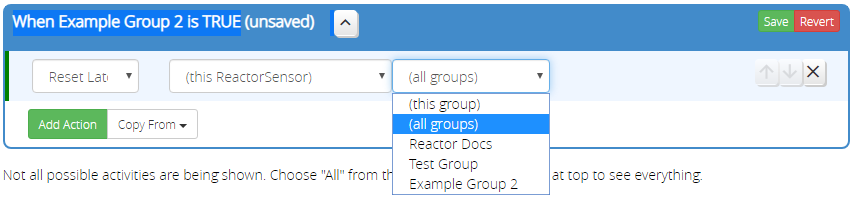

# Reset Latched Action

The _Reset Latched_ activity resets any latched conditions *in* the specified group of a ReactorSensor (the current ReactorSensor or another), or in all groups.



If a group is specified, and the group itself is latching, *it is not reset*; to reset it, you must issue the reset to its parent. Latch reset occurs *only in immediate child conditions/groups* of the specified group, and does not descend into child groups.

Consider:
```
Parent Group P
    Condition P1
    Condition P2
    Subgroup A
        Condition A1 (latching)
        Subgroup B
            Condition B1
            Condition B2 (latching)
        Subgroup C (latching)
            Condition C1
            Condition C2
```

* *Reset Latched* on A will reset A1 and C, but not B2.
* *Reset Latched* on B will reset B2 only.
* *Reset Latched* on C will do nothing because neither C1 nor C2 is latching.
* *Reset Latched* on P will do nothing because P1, P2 and A are not latching.
* *Reset Latched* on all groups will reset all latching conditions everywhere.