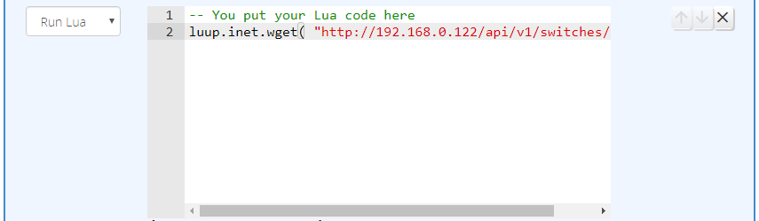

# Run Lua Action

The _Run Lua_ action allows you to run a Lua script. This works the same way as scene Lua, except that you can use the RunLua action as often as you want, where you want, not just at the beginning of the activity.

Like scene Lua, if your script returns boolean _false_, execution of the actions in the activity stops at that point. If anything other than boolean _false_ is returned (including nothing), execution continues.

!!! attention
    Because Reactor is a plugin, and Vera runs plugins in different sandboxes (environments) from other plugins and startup Lua, globals defined outside of Reactor are not visible to Lua in Reactor. If you have a library of functions you define in your startup Lua, you can convert this code to a Lua module, which can then be used in startup Lua, scene Lua, Reactor Run Lua actions, or anywhere else. See "Converting Startup Lua to a Module" below.

## Error Logging

Errors thrown by your script will be logged both to the Luup log file and the ReactorSensor's event log (which you can see in the Logic Summary, linked from the "Tools" tab of your ReactorSensor).

In addition, the environment provides an override of the Lua print() function that writes arguments to both the Luup log file and the ReactorSensor's event log. This is a handy way to get debug output from your script if you need it, as it's generally easier to find these messages in the event log than it is in the (usually large and verbose) Luup log file.

## Reactor Context

Your script environment will have a global table named `Reactor` that contains information about the context in which your script is executing. The following subkeys are available in this table:

* `id` - The device ID of the ReactorSensor in which the script is executing.
* `groups` - A map (table) containing the current evaluation state of all groups in the ReactorSensor. The key is the group ID. Each element of the table is itself a table (referred to here as a *status object*) with the following keys: `id` (the group ID), `state` (boolean true/false, the current state), `since` (Unix timestamp of the last evaluation state change), `changed` (boolean true/false, *true* if the `state` changed immediately prior to this run of the Lua fragment). Ex: `local groupstate = Reactor.groups.grp2734ana3.state`
* `conditions` - Like `groups`, but for conditions. The keys are condition IDs. The elements have the same structure as `groups` above, with the addition of two values: `currentvalue` (the current value of the test condition that led to the state), and `priorvalue` (the prior value of the test condition). For example, for a "Device State" condition testing a temperature sensor's current temperature, these values will be the temperatures read/used in the operation.
* `trip` - A map containing group status objects for those groups which last caused the ReactorSensor to trip;
* `untrip` - A map containing group status objects for those groups which last caused the ReactorSensor to untrip;
* `script` - The internal name of the running script (for debug purposes);
* `variables` - A table containing the current values of all expression/variables defined in the ReactorSensor (so you don't need to use `luup.get_variable()` to access them).
* `dump( var )` - A utility function you can use to return a formatted string representation of a value (e.g. for use in a `print()` or `luup.log()` call); this function stringifies tables in a JSON-like way, so you can see the contents of the table structure rather than Lua's default (not-very-informative) presentation "table: 0x14e123". For fun, try `print(Reactor.dump(luup.devices))` to see a dump of all your device data in the Logic Summary (hint: put the output through jsonlint.com to get a pretty-printed version that humans can more easily read).

## Other RunLua Environment Features

The RunLua environment shares loaded modules between scripts, so if two of your scripts, whether in the same ReactorSensor or different, `require` a module, that module is loaded only once. This makes the environment more memory-efficient.

The RunLua environment also contains code to warn you if your script accesses an undeclared variable, or if it creates a variable without the `local` declaration (i.e. creates a global variable). Global variables are generally to be avoided when possible.

## Enhanced Editor

Reactor attempts to load the ACE syntax-highlighting editor in the Activities tab for editing _Run Lua_ code. If you do not want to use ACE, you can set the `LoadACE` state variable in the Reactor master device to 0.

You can control the version of ACE that is used, and the source from which it is loaded, by setting the `ACEURL` state variable on the Reactor master device to a full URL of any version of ACE you wish (including code stored on LAN-local servers, so Internet access is not required).

You can also control options that are passed to ACE, such as theme. You can set these options by providing a JSON-formatted options structure in the `AceOptions` state variable.

## Converting Startup Lua to a Module

Please refer to this thread: [http://forum.micasaverde.com/index.php/topic,122435.msg445855.html#msg445855](http://forum.micasaverde.com/index.php/topic,122435.msg445855.html#msg445855)