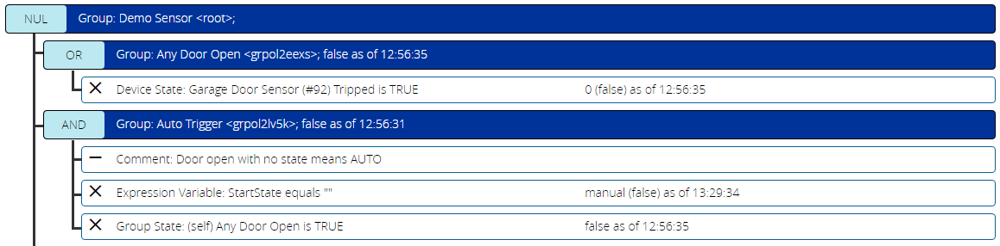
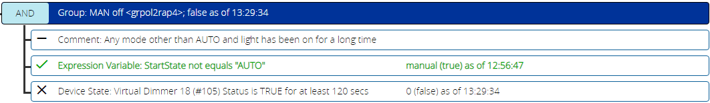
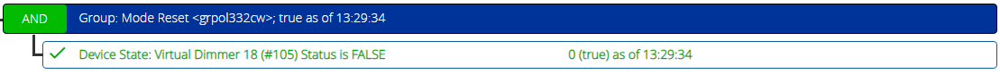
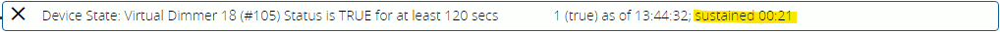

# Reading the Status Display

To help you visualize your conditions, a ReactorSensor's device control panel shows a status display with all of the configured condition groups and their respective groups and conditions.

The above image shows a fairly typical ReactorSensor hierarchy. The "root" group is in "NUL" logic mode. It contains two subgroups, named "Any Door Open" and "Auto Trigger" respectively. You should take note of the following:

1. None of the groups is *true*, as evidenced by the absence of green highlighting of the group operator (NUL, OR, AND).
2. None of the conditions is *true*, as evidenced by the absence of green color of the condition text.

If you look at any of the three group headers, you'll see it shows you the group name and ID, as well as the text of group's status ("true" or "false") followed by "as of" and the time at which that status took effect.

Looking at the first condition (in the "Any Door Open" group), the icon at left will be an "X" for a *false* condition or check mark for a true condition, followed by a text description of the condition (e.g. "Device State: Garage Door Sensor (\#92) Tripped is TRUE"). To the right of that is the current value that the test has evaluated, which is "0", indicating in this case that the `Tripped` state variable being tested currently has a value of 0. The `(false)` in parentheses, then, is the result of the test--since the test is "Tripped is TRUE" but the current value of `Tripped` is 0, the result is *false*. Finally, the effective time of that value and state is shown.

If your ReactorSensor also contains variables (defined by expressions, see Variables & Expressions, above), an addition section will display the name, expression, and most recent value for each.

When a *condition* goes *true*, it will show green text, and instead of an "X" in its left margin, it will have a check mark, like this:

When a *group* goes *true*, its operator background color will turn green, and it will show *true* in text to the right of the group ID:

If you have a condition with timing options in effect, such as a delay reset or "sustained for" option, there will be a running timer in the status area counting up or down (as appropriate to the delay type). The yellow highlighted text below shows that the "sustained for" timing on the condition is 21 seconds along:

This raises a new concept: *test state* (or *test result*) vs *evaluation state*. The *test state* is the direct result of the test performed in the condition. If we look at the status data shown for the above condition, we can see it reports "1 (true) as of 13:44:32", meaning that the current value of the `Status` variable being tested on the device is "1", and therefore the "Status is TRUE" test is *true*, and that happened at 13:44:32. But notice that the condition does not have green text or a checkmark--the overall *evaluation state* of the condition is not yet *true* because the timing constraint ("for at least 120 seconds"--the "sustained for" restriction) has not yet been met. When this condition has remained true for the required 120 seconds, then and only then will the *evaluation state* of the condition be *true*, and the condition show green with a check mark.

## Status Display Refresh Rate

The Status display is dependent on the Vera UI's (or ALTUI's) refresh rate, which is basically about every two seconds. That means any condition transitions that occur in less than that time may not be visible on the status display. There are conditions such as "Luup Reload" and condition operators such as *updates* and *changes* for *Device State* conditions that produce a pulse output by default, and the pulse is usually as fast as the Vera can process it--one second or less. That means these conditions may not show their status in the display, simply because they go from *false* to *true* to *false* inside of a single UI refresh. Their effect is still seen by the execution of any Activities that may be related, but the transition itself isn't shown. You can use "delay reset" options on these conditions to stretch out the timing during your debugging/development of your logic to make the transitions visible.