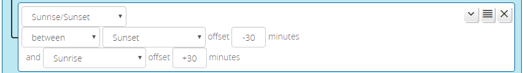

# Sunrise-Sunset Condition

The _Sunrise/Sunset_ condition allows you to create a condition that is active (true) before or after sunrise or sunset, or between sunrise and sunset (or the reverse, for an overnight period). 

The operators ("before", "after", etc.) are the same for _Sunrise/Sunset_ conditions as they are for [_Date/Time_ conditions](Date-Time-Conditions.md).

The _Sunrise/Sunset_ condition operands include offsets to the specified timing milestone. For example, one could specify that the condition is active from 30 minutes before sunset ("before sunset -30") to 30 minutes after sunrise ("after sunrise +30"). The offsets are in minutes, and may be positive, negative or zero.

_Sunrise/Sunset_ conditions also have options for the use of civil, nautical, and astronomical dawn and dusk. All sunrise/sunset condition tests require that your time zone and geographical location be properly configured in the Vera or openLuup settings.

!!! attention
    If your logic relies on accurate time, please see the "CLOCK INVALID" topic in the [FAQ](FAQ.md). There are conditions under which the system clock can be completely invalid, and steps you can take to prevent undesirable behavior when this occurs.
