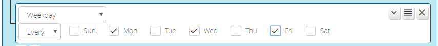

# Weekday Conditions

_Weekday_ conditions allow you to create triggers for certain days of the week, and in particular, on certain days of the month. This allows you to trigger, for example, every Monday, Wednesday, and Friday; or every 2nd Sunday. Simply select the days of the week on which the condition should be true, and select the ordinal for the day, which is "Every" by default, but can also be one of "First", "Second", "Third", "Fourth", "Fifth" or "Last".

